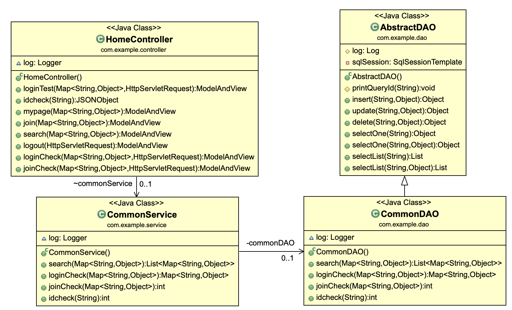
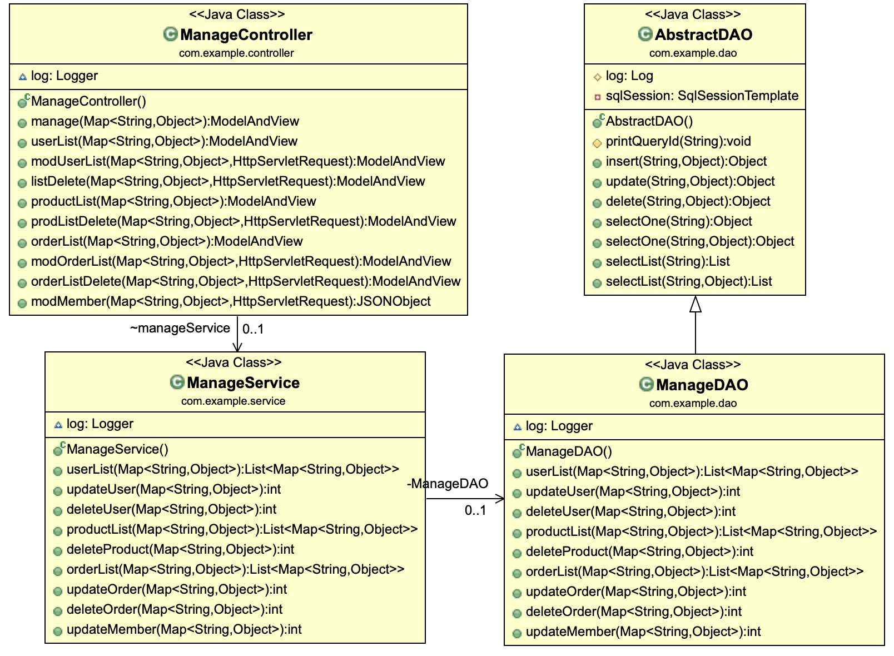
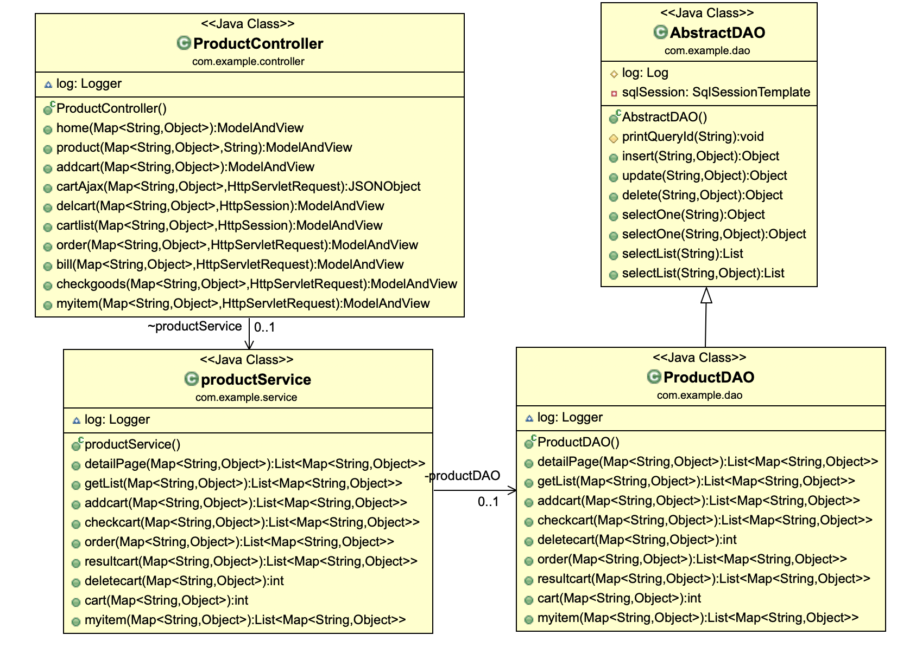
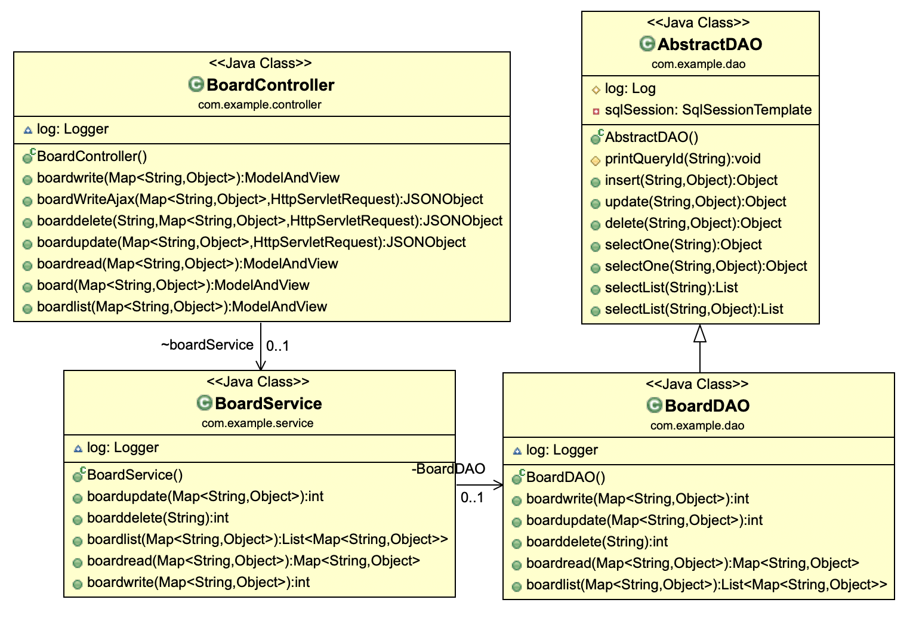

# 🛒 쇼핑몰 프로젝트 SME

## 📄 개발 배경

쇼핑몰에서 주문 접수와 판매를 진행하다 보면, 자료의 취합이 어려워 재고관리를 포기하는 경우가 많다.

SME 쇼핑몰 프로젝트에서는 재고관리와 ERP를 연동한 웹 쇼핑몰을 개발해 쇼핑몰에 산재한 재고관리 데이터를 통합하여 확인하고 관리할 수 있게 했다.

## ⚙️ 개발 환경

* Eclipse EE

* MySQL Work Bench

* Visual Studio

* Sourcetree

* Spring Framework

* Mybatis

* Bootstrap

* Github

  

## 👨‍💻 사용 언어 및 기술

* Java
* JAVAScript
* CSS3
* JSP
* JSTL
* JQuery
* HTML5
* MySQL
* EC2
* S3

## 💁‍♂️프로젝트 구성원 및 분담 업무

**최준혁**

* DB구축
* 로그인, 로그아웃 기능 구현
* 관리자페이지 기능 구현
* 검색기능 구현

**이성규**

* DB구축
* 회원가입 기능 구현
* 회원정보 수정기능 구현
* 게시판 기능 구현

**최규동**

* DB구축
* 장바구니 기능 구현
* 구매하기 기능 구현

## 📊 다이어그램

1. Usecase Diagram 

2. Class Diagram

* home(메인페이지)

* Manage(관리자)

* Product(상품())

* board(게시판)

3. Flow Chart

* 구매 플로우차트

* 결제 플로우차트

## 💡 작동 화면

https://m.blog.naver.com/PostView.naver?blogId=fx887722&logNo=222356044735&navType=by

